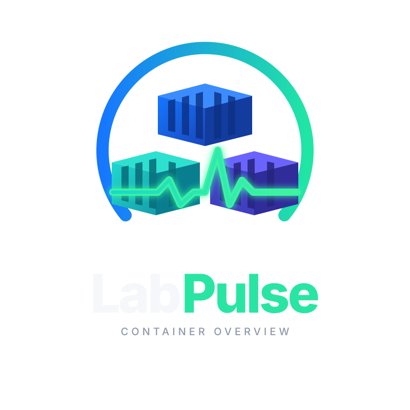

# LabPulse



LabPulse is something I built for my own homelab because I got tired of
staring at Portainer wondering *"didn't this container just restart a
minute ago?"* and having no way to check. Most monitoring tools tell you
whether things are OK right now. LabPulse is more of a flight recorder —
it remembers what happened, when it happened, what changed around the
same time, and it groups the noisy bits (a flapping container throwing
out five events in ten seconds) into a single incident instead of five
separate alerts.

It's a single Docker container. It watches your Docker socket, keeps a
history of container state, resource usage, and lifecycle events, and
gives you a web UI to dig through all of it.

## What it actually does

- **Container discovery** — polls your Docker daemon every 15 seconds
  (configurable) and keeps track of every container it finds, including
  ones that have since disappeared.
- **Event timeline** — listens to the Docker event stream live, so
  starts, stops, kills, restarts, and health-check changes all get
  logged with a timestamp and a sensible severity, not just raw JSON.
- **Resource history** — samples CPU%, memory%, and network RX/TX for
  every running container on the same cadence, so you can look back at
  a chart instead of only seeing the current number.
- **Incident correlation** — groups related events from the same
  container into a single incident rather than flooding you with
  individual alerts. This is a simple time-window rule, not machine
  learning, and I've kept it that way on purpose — it's predictable.
- **"What changed?"** — hourly snapshots of every container's
  name/image/state/restart count, so you can ask "what's different
  from 24 hours ago / a week ago" and get an actual answer (new
  container, removed container, image bump, restart, CPU/memory drift).
- **A dashboard** that ties all of the above together, with per-container
  detail pages, a filterable resource chart, and pages for incidents and
  the change log.

It does **not** try to be Prometheus/Grafana, and it doesn't monitor
anything outside a single Docker host yet (no remote agents, no
Proxmox/TrueNAS/OPNsense support). That's deliberately out of scope for
now — see [docs/ROADMAP.md](docs/ROADMAP.md) if you're curious where
it's headed.

## How it's put together

One container, two logical halves:

- A FastAPI backend that talks to the Docker socket (read-only, never
  over TCP, never privileged) and exposes everything under `/api`.
- A React/TypeScript frontend, built at image-build time and served by
  the same FastAPI app as static files.

Everything lives in SQLite by default, on a Docker volume, so there's no
separate database container to run. If you'd rather point it at your own
PostgreSQL instance, you can — see the configuration section below.
For more detail than you probably want, there's
[docs/ARCHITECTURE.md](docs/ARCHITECTURE.md).

## Deploying it

You need a Docker host with Docker Compose, and access to
`/var/run/docker.sock` (it gets mounted read-only into the container —
LabPulse never needs write access to your socket, and I'd be suspicious
of anything that claims to need it for this kind of tool).

### Pull the pre-built image (easiest)

```bash
git clone https://github.com/MattKrayson/labpulse.git
cd labpulse
docker compose pull
docker compose up -d
```

Then open `http://<your-host>:8080`.

### Build it yourself instead

If you don't want to pull an image from GHCR, or you've made local
changes, edit `docker-compose.yml`: comment out the `image:` line and
uncomment the `build:` block underneath it, then run:

```bash
docker compose up -d --build
```

### First run

On first boot LabPulse logs you in with a single shared admin account
(`admin` / `admin` unless you've changed the env vars below — please do
change them) and then walks you through a short setup wizard to pick a
database: the bundled SQLite one (just click through, nothing to fill
in) or your own PostgreSQL connection details. It tests the connection
before committing to it, and applying a database choice restarts the
container so every background job starts clean against it. You can come
back to this later from the "Database" link in the dashboard header if
you ever want to switch.

## Configuring it

Everything is controlled with `LABPULSE_*` environment variables, set
either directly in `docker-compose.yml` or via a `.env` file next to it
(copy `.env.example` to `.env` to start). Nothing here is required to get
going — the defaults work — but you'll want to change the admin
credentials and secret key before exposing this to anything other than
your own LAN.

| Variable | Default | What it does |
|---|---|---|
| `LABPULSE_DATABASE_URL` | *(blank)* | Full SQLAlchemy URL for an external database (e.g. Postgres). Leave blank to use the bundled SQLite database instead. |
| `LABPULSE_EVENT_RETENTION_DAYS` | `30` | How long events (and incidents once resolved) are kept before they're pruned. |
| `LABPULSE_METRIC_RETENTION_DAYS` | `7` | How long CPU/memory/network samples are kept. Snapshots for "What changed?" reuse the event retention setting. |
| `LABPULSE_POLL_INTERVAL` | `15` | Seconds between container discovery and metrics collection passes. |
| `LABPULSE_ADMIN_USERNAME` | `admin` | Login username for the single shared admin account. |
| `LABPULSE_ADMIN_PASSWORD` | `admin` | Login password — change this. |
| `LABPULSE_SECRET_KEY` | `insecure-dev-secret-change-me` | Signs the login session cookie. Change it, and note that changing it later logs everyone out. |

There's no multi-user support and no fine-grained permissions — it's
built on the assumption that this sits on a private homelab network
behind your own firewall, not exposed to the internet.

## Data and backups

Everything (the SQLite database, if you're using it) lives on the
`labpulse-data` Docker volume, so it survives container restarts and
rebuilds. If you switch to an external Postgres database instead, that
volume is only used for the setup wizard's saved connection choice — the
actual data lives wherever you pointed it. Back up whichever of those
applies to you the same way you'd back up anything else in your homelab.

## Updating

```bash
docker compose pull
docker compose up -d
```

Database schema changes are applied automatically via Alembic migrations
on startup, so you shouldn't need to do anything else.

## Working on it locally

If you want to run the backend and frontend separately instead of
through Docker (for development), see
[docs/DEVELOPMENT.md](docs/DEVELOPMENT.md).

## Docs

- [docs/ARCHITECTURE.md](docs/ARCHITECTURE.md) — how it's built, in more depth
- [docs/DEVELOPMENT.md](docs/DEVELOPMENT.md) — running it locally, outside Docker
- [docs/ROADMAP.md](docs/ROADMAP.md) — what's done and what's still just an idea

## Tech stack

- Backend: Python, FastAPI, SQLModel, Alembic, SQLite (or PostgreSQL)
- Frontend: React, TypeScript, Vite, Tailwind CSS
- Deployment: Docker Compose, single-container image
